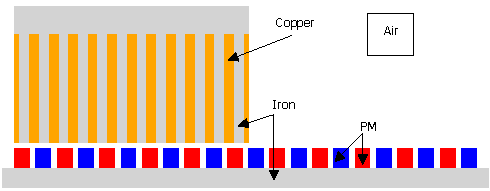

# Linear Motor 2D Dataset (LiM2D)
Dataset of the two-dimension (2D) electromagnetic field of linear machines

The demand for AI-based electromagnetic approximation for the optimal design of electromagnetic products has significantly increased recently. However, the lack of a publicly available dataset and the unclear definition of each parameter in the electromagnetic field dataset severely limit the expansion of electromagnetic field approximation. This paper proposes a linear motor-based electromagnetic field dataset, which includes the current density, material distribution, electromagnetic material properties, and other parameters of the linear motor. The distribution of the motor structure also includes different slot-pole combinations, including working motors and non-working motors. We have also proposed some indicators for further evaluation of electromagnetic approximation performance, including image-based metrics and calculation methods for the performance of the linear motor itself. Finally, we identified some challenges of electromagnetic field approximation.
## Paper

A Fast Electromagnetic Field ApproximationMethod for Linear Machine

## Install

Coming soon...
